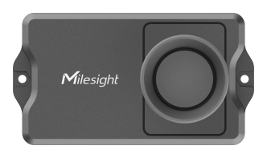
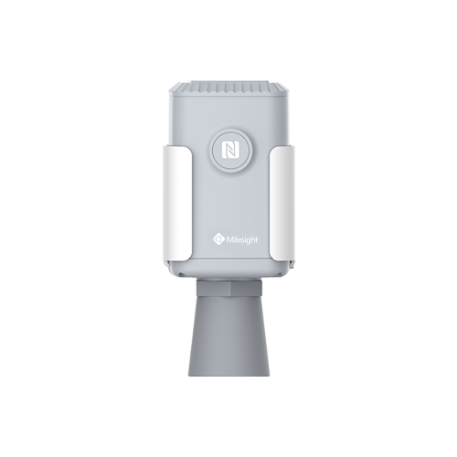

# DecoderPayload

 

## Description
DecoderPayload est un projet conçu pour décoder des payloads LoraWan et afficher le résultat dans le but de l'implémenter dans une solution IoT. Il permet de faciliter l'intégration des données LoraWan dans des applications IoT.

DecoderPayload is a project designed to decode LoraWan payloads and display the result with the aim of implementing it in an IoT solution. It allows for easier integration of LoraWan data into IoT applications.

## Inspiration
Ce projet a utilisé des exemples et s'est inspiré du lien suivant pour le code de décodage : [Milesight-IoT/SensorDecoders](https://github.com/Milesight-IoT/SensorDecoders/tree/main/EM_Series).

This project used examples and was inspired by the following link for the decoding code: [Milesight-IoT/SensorDecoders](https://github.com/Milesight-IoT/SensorDecoders/tree/main/EM_Series).

This project was developed as part of an internship at IO CONNECT Solutions. All rights reserved.

## Auteurs
- **Franck VALMONT** - [GitHub](https://github.com/Franck1vlt)
- **Raphël PAYET** - [GitHub](https://github.com/RaphaelPayet)
